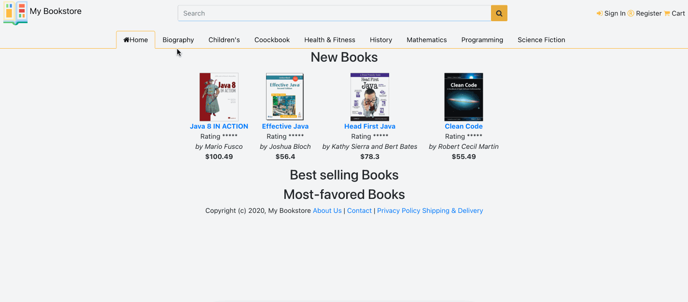

# *Online Bookstore*

**Online Bookstore** is a Java web application that allows users to buy books online.Users of the system: visitors/browsers, registered customers, store clerks, store managers/super-users.

## Main features of the system

* [x] The online store has a home page showing the lists of new books, best selling books and most popular books.
* [x] The system provides different categories for the books.
* [x] A visitor can browse the listings of the books and discussion forums.
* [ ] A visitor can apply to be a registered customer with a unique working email address.
* [ ] A registered customer must provide a working credit card or deposit money to the account for possible purchase.
* [ ] A registered customer can browse the system, make purchase options, search info, browse his/her own private purchasing history/expenses, comments and (start) votes on the items s/he purchased already.

## Video Walkthrough

GIF created with [LiceCap](http://www.cockos.com/licecap/).

## Notes

Describe any challenges encountered while building the app.

## License

    Copyright [yyyy] [name of copyright owner]

    Licensed under the Apache License, Version 2.0 (the "License");
    you may not use this file except in compliance with the License.
    You may obtain a copy of the License at

        http://www.apache.org/licenses/LICENSE-2.0

    Unless required by applicable law or agreed to in writing, software
    distributed under the License is distributed on an "AS IS" BASIS,
    WITHOUT WARRANTIES OR CONDITIONS OF ANY KIND, either express or implied.
    See the License for the specific language governing permissions and
    limitations under the License.

## Tools used in this project

* Java Development Kit 8
* Eclipse IDE 
* Tomcat web server
* MySQL database server
* Hibernate framework with JPA
* JSP and JSTL
* HTML, CSS, Javascript and jQuery
* Junit for writing unit tests

